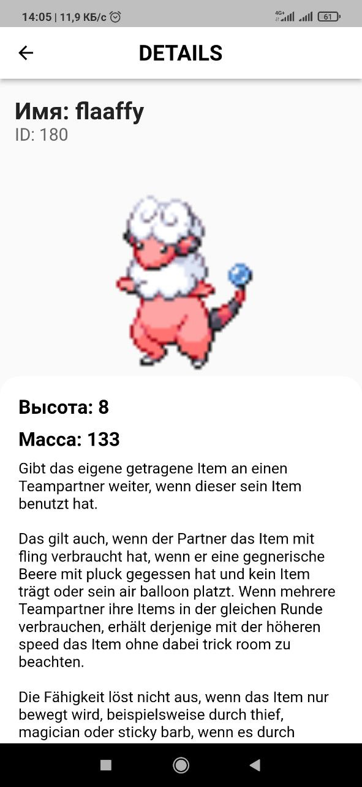

# Pokemon на flutter


Приложение состоит из:
- Заставка;
- Меню, содержащее две кнопки с переходами на экраны 3 и 4;
- Экран поиска покемона по имени, содержит поле ввода имени покемона нa кнопку поиск;
- Экран вывода случайного покемона, по нажатию на кнопку отображаеться информация о случайном покемоне.

Технологический стэк:
- Pattern BloC(в виде библиотеки);
- Использование stateful/stateless в том или ином виде;
- Использование BloC;
- Использование Future/async/await;
- Для работы с сетью - http.

## Начало работы

Эти инструкции помогут вам настроить копию проекта на вашем локальном компьютере для разработки и запуска.

### Предварительные условия

Что нужно для работы с Flutter:

- Flutter SDK
- Android Studio / IntelliJ или Visual Studio Code с установленными плагинами для Flutter и Dart
- Эмулятор или физическое устройство

#### Установка Flutter SDK

Перейдите на [официальный сайт Flutter](https://flutter.dev/docs/get-started/install) и следуйте инструкциям по установке SDK для вашей операционной системы.

### Установка проекта

Клонирование репозитория:

```bash
git clone https://github.com/Jonibek96/pokemon-flutter.git
cd pokemon-flutter
```

### Установка зависимостей:

```
flutter pub get
```

### Запуск приложения:

```
flutter run
```

### Screenshots

 | 
 | 
